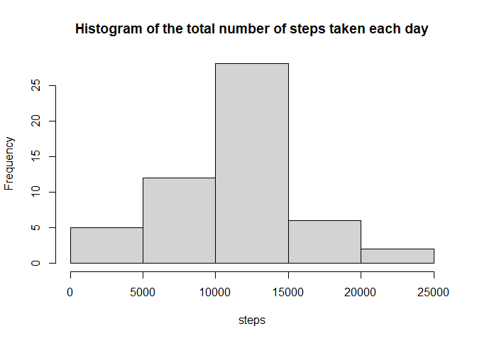
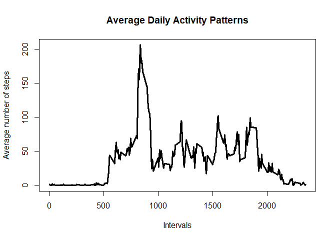
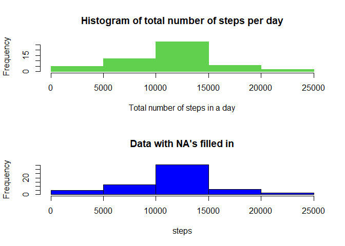
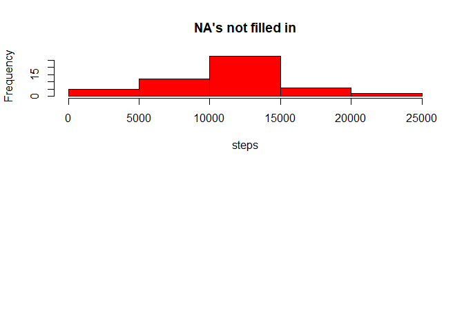
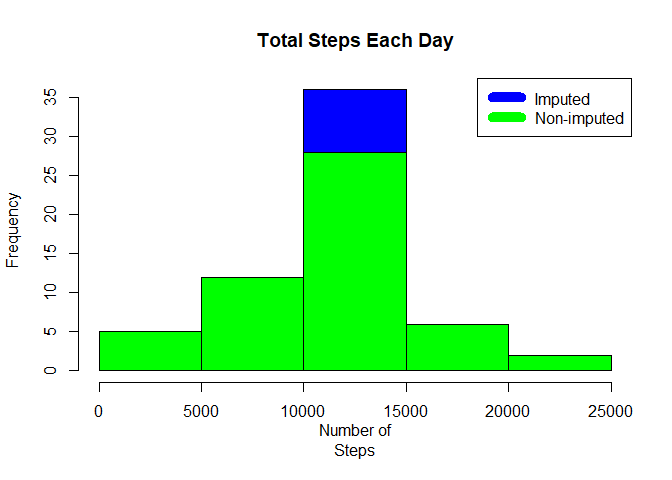
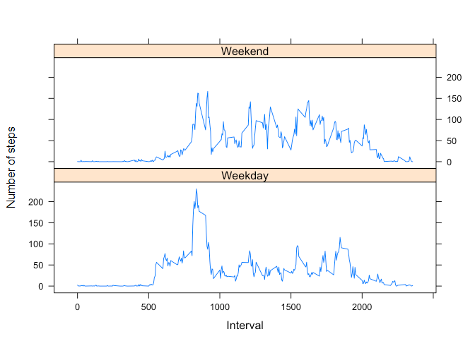

Load library

```r
library("data.table")
```

```
## Warning: package 'data.table' was built under R version 4.0.3
```

```r
library(RColorBrewer)
library(ggplot2)
library(knitr)

opts_chunk$set(echo = TRUE, results = 'hold')
path <- getwd()
```

#Loada data


```r
data <- read.csv("activity.csv", header = TRUE, sep = ",", na.strings = "NA")
new_data <- na.omit(data)
```


```r
summary(data)
```

```
##      steps            date              interval     
##  Min.   :  0.00   Length:17568       Min.   :   0.0  
##  1st Qu.:  0.00   Class :character   1st Qu.: 588.8  
##  Median :  0.00   Mode  :character   Median :1177.5  
##  Mean   : 37.38                      Mean   :1177.5  
##  3rd Qu.: 12.00                      3rd Qu.:1766.2  
##  Max.   :806.00                      Max.   :2355.0  
##  NA's   :2304
```


```r
str(data)
```

```
## 'data.frame':	17568 obs. of  3 variables:
##  $ steps   : int  NA NA NA NA NA NA NA NA NA NA ...
##  $ date    : chr  "2012-10-01" "2012-10-01" "2012-10-01" "2012-10-01" ...
##  $ interval: int  0 5 10 15 20 25 30 35 40 45 ...
```

##  What is mean total number of steps taken per day?

1. Calculate the total number of steps taken per day


```r
daily<-c()  # This will be the total number of steps taken per day


for (i in 1:61){ # total number of days in October and November is 31+30=61
    start<-(i-1)*288+1  # 288 five-minute steps in a day; 24*60/5=288
    last<-(i-1)*288+288
    temp<-data[start:last,1]    # extracting all 5-minute steps for each day
    daily<-c(daily,sum(temp))   # concatenating the daily totals  
    
     }
```

plot histograma 

```r
daily_noNA<-daily[!is.na(daily)]  # 8 NA's are removed

hist(daily_noNA, xlab="steps",ylab="Frequency",
     main="Histogram of the total number of steps taken each day")
```

<!-- -->

3. Calculate and report the mean and median of the total number of steps taken per day


```r
mean(daily,na.rm=T)
median(daily,na.rm=T)
```

```
## [1] 10766.19
## [1] 10765
```

## What is the average daily activity pattern?

1. Make a time series plot (i.e. 𝚝𝚢𝚙𝚎 = "𝚕") of the 5-minute interval (x-axis) and the average number of steps taken, averaged across all days (y-axis)


```r
x<-data[,1]         # number of steps in 5-minute intevals
y<-matrix(x,288,61) # so as to get average of 5-minute intevals across all days  

five_average<-apply(y,1,mean,na.rm=TRUE)  # 5-minute interval average number of steps taken, 
# averaged across all days

plot(data$interval[1:288],five_average, type='l',
     xlab='Intervals',lwd=3,
     ylab='Average number of steps',
     main ='Average Daily Activity Patterns')
```

<!-- -->

2. Which 5-minute interval, on average across all the days in the dataset, contains the maximum number of steps?


```r
# find row id of maximum average number of steps in an interval
max_row_id <-which.max(five_average)

# get the interval with maximum average number of steps in an interval
interval_steps <- aggregate(steps ~ interval, new_data, mean)
interval_steps [max_row_id, ]
```

```
##     interval    steps
## 104      835 206.1698
```


## Imputing missing values

1. Calculate and report the total number of missing values in the dataset (i.e. the total number of rows with 𝙽𝙰s)


```r
sum(is.na(data[,1]))
```

```
## [1] 2304
```

2. Devise a strategy for filling in all of the missing values in the dataset. The strategy does not need to be sophisticated. For example, you could use the mean/median for that day, or the mean for that 5-minute interval, etc.


```r
five_average_rep<- rep(five_average,61)

data1<-data   # creating a copy of the datset so as to not mess up the original data

for (i in 1:length(data1[,1])){  # there are 61 days
    
    if(is.na(data1[i,1])==TRUE){
        data1[i,1]= five_average_rep[i]  # missing values replaced
    }}
```

3. Create a new dataset that is equal to the original dataset but with the missing data filled in.


```r
daily1<-c()


for (i in 1:61){              #  the total number of days in October and November is 31+30=61
    start<-(i-1)*288+1        #  there are 288 five-minute steps in a day; 24*60/5=288
    last<-(i-1)*288+288
    temp<-data1[start:last,1]    # extracting all 5-minute steps for each day
    daily1<-c(daily1,sum(temp))   # concatenating the daily totals 
}

daily1 <- na.omit(daily1)
```


4. Make a histogram of the total number of steps taken each day and calculate and report the mean and median total number of steps taken per day. Do these values differ from the estimates from the first part of the assignment? What is the impact of imputing missing data on the estimates of the total daily number of steps?


```r
par(mfrow=c(2,1))


# aggregate steps as per date to get total number of steps in a day
inserted <- aggregate(steps ~ date, data, sum)

# create histogram of total number of steps in a day
hist(inserted$steps, col=3, border = 3, main="Histogram of total number of steps per day", xlab="Total number of steps in a day")


hist(daily1, xlab="steps",ylab="Frequency",
     main="Data with NA's filled in",col='blue')
```

<!-- -->

```r
hist(daily_noNA, xlab="steps",ylab="Frequency",
     main="NA's not filled in",col="red",)
```

<!-- -->


```r
# The mean of  total number of steps taken per day is:

mean(daily1)

# The median of  total number of steps taken per day is:

median(daily1)
```

```
## [1] 10766.19
## [1] 10766.19
```

Do these values differ from the estimates from the first part of the assignment? What is the impact of imputing missing data on the estimates of the total daily number of steps?

```r
StepsAverage <- aggregate(steps ~ interval, data = data, FUN = mean)
fillNA <- numeric()
for (i in 1:nrow(data)) {
obs <- data[i, ]
if (is.na(obs$steps)) {
steps <- subset(StepsAverage, interval == obs$interval)$steps
} else {
steps <- obs$steps
}
fillNA <- c(fillNA, steps)
}

new_activity <- data
new_activity$steps <- fillNA


steps_by_day <- aggregate(steps ~ date, data, sum)
StepsTotalUnion <- aggregate(steps ~ date, data = new_activity, sum, na.rm = TRUE)
hist(StepsTotalUnion$steps, main = paste("Total Steps Each Day"), col="blue", xlab="Number of
Steps")
#Create Histogram to show difference.
hist(steps_by_day$steps, main = paste("Total Steps Each Day"), col="green", xlab="Number of S
teps", add=T)
legend("topright", c("Imputed", "Non-imputed"), col=c("blue", "green"), lwd=10)
```

<!-- -->

```r
## Yes, they show diferreneces in the median and in the histograms. imputing missing data on the estimates of the total daily number of steps changes the median, and the distribution as as can be seen from the histograms.
## On observation the impact of the missing data has the biggest effect on the 10000 - 150000 step interval and changes frequency from 27.5 to 35 a variance of 7.5
## Based on the method used for filling in missing values, we can get different mean and median values. The histogram can also be different based on the strategy we used to fill in the missing values. 
```

## Are there differences in activity patterns between weekdays and weekends?

1. Create a new factor variable in the dataset with two levels – “weekday” and “weekend” indicating whether a given date is a weekday or weekend day.


```r
# Create a new factor variable in the dataset with two levels – “weekday” and “weekend” indicating whether a given date is a weekday or weekend day.

day <- weekdays(as.Date(data$date))

daylevel <- vector()
for (i in 1:nrow(data)) {
    if (day[i] == "Saturday") {
        daylevel[i] <- "Weekend"
    } else if (day[i] == "Sunday") {
        daylevel[i] <- "Weekend"
    } else {
        daylevel[i] <- "Weekday"
    }
}
data$daylevel <- daylevel
data$daylevel <- factor(data$daylevel)

stepsByDay <- aggregate(steps ~ interval + daylevel, data = data, mean)
names(stepsByDay) <- c("interval", "daylevel", "steps")
```


2. Make a panel plot containing a time series plot (i.e. 𝚝𝚢𝚙𝚎 = "𝚕") of the 5-minute interval (x-axis) and the average number of steps taken, averaged across all weekday days or weekend days (y-axis). See the README file in the GitHub repository to see an example of what this plot should look like using simulated data.

```r
# make the panel plot for weekdays and weekends
library(lattice)

# create the panel plot
xyplot(steps ~ interval | daylevel, stepsByDay, type = "l", layout = c(1, 2), 
    xlab = "Interval", ylab = "Number of steps")
```

<!-- -->

