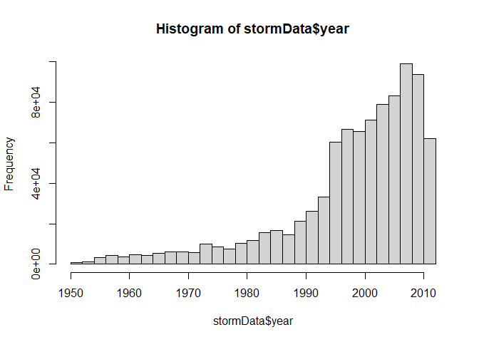
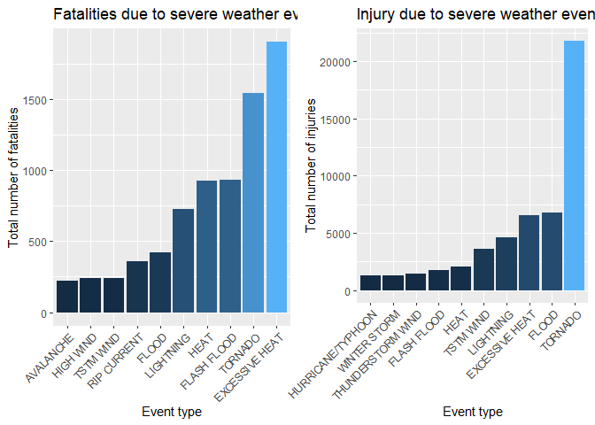
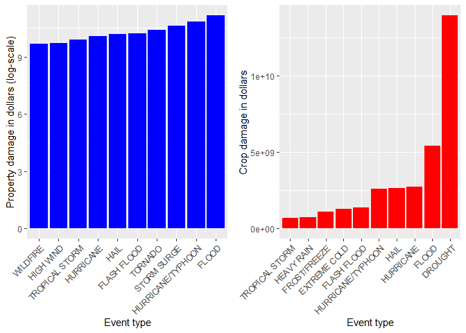

# Synonpsis

In this report, we aim to analyze the impact of different weather events on public health and economy based on the storm database collected from the U.S. National Oceanic and Atmospheric Administration's (NOAA) from 1950 - 2011. We will use the estimates of fatalities, injuries, property and crop damage to decide which types of event are most harmful to the population health and economy. From these data, we found that excessive heat and tornado are most harmful with respect to population health, while flood, drought, and hurricane/typhoon have the greatest economic consequences.


# Data Processing


```r
library("data.table")
```

```
## Warning: package 'data.table' was built under R version 4.0.3
```

```r
library(RColorBrewer)
library(ggplot2)
library(lattice)
library(knitr)
library(plyr)
```

```
## Warning: package 'plyr' was built under R version 4.0.3
```

```r
library(gridExtra)
```

```
## Warning: package 'gridExtra' was built under R version 4.0.3
```

```r
opts_chunk$set(echo = TRUE, results = 'hold')
path <- getwd()
```


```r
stormData <- read.csv("StormData.csv", header = TRUE, sep = ",", na.strings = "NA")
```


```r
head(stormData)
```

```
##   STATE__           BGN_DATE BGN_TIME TIME_ZONE COUNTY COUNTYNAME STATE  EVTYPE
## 1       1  4/18/1950 0:00:00     0130       CST     97     MOBILE    AL TORNADO
## 2       1  4/18/1950 0:00:00     0145       CST      3    BALDWIN    AL TORNADO
## 3       1  2/20/1951 0:00:00     1600       CST     57    FAYETTE    AL TORNADO
## 4       1   6/8/1951 0:00:00     0900       CST     89    MADISON    AL TORNADO
## 5       1 11/15/1951 0:00:00     1500       CST     43    CULLMAN    AL TORNADO
## 6       1 11/15/1951 0:00:00     2000       CST     77 LAUDERDALE    AL TORNADO
##   BGN_RANGE BGN_AZI BGN_LOCATI END_DATE END_TIME COUNTY_END COUNTYENDN
## 1         0                                               0         NA
## 2         0                                               0         NA
## 3         0                                               0         NA
## 4         0                                               0         NA
## 5         0                                               0         NA
## 6         0                                               0         NA
##   END_RANGE END_AZI END_LOCATI LENGTH WIDTH F MAG FATALITIES INJURIES PROPDMG
## 1         0                      14.0   100 3   0          0       15    25.0
## 2         0                       2.0   150 2   0          0        0     2.5
## 3         0                       0.1   123 2   0          0        2    25.0
## 4         0                       0.0   100 2   0          0        2     2.5
## 5         0                       0.0   150 2   0          0        2     2.5
## 6         0                       1.5   177 2   0          0        6     2.5
##   PROPDMGEXP CROPDMG CROPDMGEXP WFO STATEOFFIC ZONENAMES LATITUDE LONGITUDE
## 1          K       0                                         3040      8812
## 2          K       0                                         3042      8755
## 3          K       0                                         3340      8742
## 4          K       0                                         3458      8626
## 5          K       0                                         3412      8642
## 6          K       0                                         3450      8748
##   LATITUDE_E LONGITUDE_ REMARKS REFNUM
## 1       3051       8806              1
## 2          0          0              2
## 3          0          0              3
## 4          0          0              4
## 5          0          0              5
## 6          0          0              6
```

The events in the database start in the year 1950 and end in November 2011. 
To better understand how the storms evolved over the years, a histogram was plotted


```r
if (dim(stormData)[2] == 37) {
    stormData$year <- as.numeric(format(as.Date(stormData$BGN_DATE, format = "%m/%d/%Y %H:%M:%S"), "%Y"))
}
hist(stormData$year, breaks = 30)
```

<!-- -->
Based on the above histogram, we see that the number of events tracked starts to significantly increase around 1995. So, we use the subset of the data from 1990 to 2011 to get most out of good records.


```r
storm <- stormData[stormData$year >= 1995, ]
dim(storm)
```

```
## [1] 681500     38
```
Now, there are 681500 rows and 38 columns in total.


## Dangerous Events with respect to Population Health

To find the event types that are most harmful to population health, the number of casualties are aggregated by the event type.


```r
casualties <- ddply(storm, .(EVTYPE), summarize,
                    fatalities = sum(FATALITIES),
                    injuries = sum(INJURIES))

# Find events that caused most death and injury
fatal_events <- head(casualties[order(casualties$fatalities, decreasing = T), ], 10)
injury_events <- head(casualties[order(casualties$injuries, decreasing = T), ], 10)
```
Top 10 events that caused most number of fatalities and injuries are: 


```r
fatal_events[, c("EVTYPE", "fatalities")]
print ('------------------------------------------')

injury_events[, c("EVTYPE", "injuries")]
```

```
##             EVTYPE fatalities
## 112 EXCESSIVE HEAT       1903
## 666        TORNADO       1545
## 134    FLASH FLOOD        934
## 231           HEAT        924
## 358      LIGHTNING        729
## 144          FLOOD        423
## 461    RIP CURRENT        360
## 288      HIGH WIND        241
## 683      TSTM WIND        241
## 16       AVALANCHE        223
## [1] "------------------------------------------"
##                EVTYPE injuries
## 666           TORNADO    21765
## 144             FLOOD     6769
## 112    EXCESSIVE HEAT     6525
## 358         LIGHTNING     4631
## 683         TSTM WIND     3630
## 231              HEAT     2030
## 134       FLASH FLOOD     1734
## 607 THUNDERSTORM WIND     1426
## 787      WINTER STORM     1298
## 313 HURRICANE/TYPHOON     1275
```
It is possible to observe that tonado is among the events that cause more damage


## Economic Effects of Weather Events

o analyze the impact of weather events on the economy, available property damage and crop damage reportings/estimates were used.

In the raw data, the property damage is represented with two fields, a number PROPDMG in dollars and the exponent PROPDMGEXP. Similarly, the crop damage is represented using two fields, CROPDMG and CROPDMGEXP. The first step in the analysis is to calculate the property and crop damage for each event.


```r
exp_transform <- function(e) {
    # h -> hundred, k -> thousand, m -> million, b -> billion
    if (e %in% c('h', 'H'))
        return(2)
    else if (e %in% c('k', 'K'))
        return(3)
    else if (e %in% c('m', 'M'))
        return(6)
    else if (e %in% c('b', 'B'))
        return(9)
    else if (!is.na(as.numeric(e))) # if a digit
        return(as.numeric(e))
    else if (e %in% c('', '-', '?', '+'))
        return(0)
    else {
        stop("Invalid exponent value.")
    }
}
prop_dmg_exp <- sapply(storm$PROPDMGEXP, FUN=exp_transform)
```

```
## Warning in FUN(X[[i]], ...): NAs introduzidos por coerção

## Warning in FUN(X[[i]], ...): NAs introduzidos por coerção

## Warning in FUN(X[[i]], ...): NAs introduzidos por coerção

## Warning in FUN(X[[i]], ...): NAs introduzidos por coerção

## Warning in FUN(X[[i]], ...): NAs introduzidos por coerção

## Warning in FUN(X[[i]], ...): NAs introduzidos por coerção

## Warning in FUN(X[[i]], ...): NAs introduzidos por coerção

## Warning in FUN(X[[i]], ...): NAs introduzidos por coerção

## Warning in FUN(X[[i]], ...): NAs introduzidos por coerção

## Warning in FUN(X[[i]], ...): NAs introduzidos por coerção
```

```r
storm$prop_dmg <- storm$PROPDMG * (10 ** prop_dmg_exp)
crop_dmg_exp <- sapply(storm$CROPDMGEXP, FUN=exp_transform)
```

```
## Warning in FUN(X[[i]], ...): NAs introduzidos por coerção

## Warning in FUN(X[[i]], ...): NAs introduzidos por coerção

## Warning in FUN(X[[i]], ...): NAs introduzidos por coerção

## Warning in FUN(X[[i]], ...): NAs introduzidos por coerção

## Warning in FUN(X[[i]], ...): NAs introduzidos por coerção
```

```r
storm$crop_dmg <- storm$CROPDMG * (10 ** crop_dmg_exp)
```


```r
 #Compute the economic loss by event type


econ_loss <- ddply(storm, .(EVTYPE), summarize,
                   prop_dmg = sum(prop_dmg),
                   crop_dmg = sum(crop_dmg))

# filter out events that caused no economic loss
econ_loss <- econ_loss[(econ_loss$prop_dmg > 0 | econ_loss$crop_dmg > 0), ]
prop_dmg_events <- head(econ_loss[order(econ_loss$prop_dmg, decreasing = T), ], 10)
crop_dmg_events <- head(econ_loss[order(econ_loss$crop_dmg, decreasing = T), ], 10)
```

Top 10 events that caused most property damage (in dollars) are: 

```r
prop_dmg_events[, c("EVTYPE", "prop_dmg")]
```

```
##                EVTYPE     prop_dmg
## 144             FLOOD 144022037057
## 313 HURRICANE/TYPHOON  69305840000
## 519       STORM SURGE  43193536000
## 666           TORNADO  24935939545
## 134       FLASH FLOOD  16047794571
## 206              HAIL  15048722103
## 306         HURRICANE  11812819010
## 677    TROPICAL STORM   7653335550
## 288         HIGH WIND   5259785375
## 773          WILDFIRE   4759064000
```
Similarly, the events that caused biggest crop damage are:


```r
crop_dmg_events[, c("EVTYPE", "crop_dmg")]
```

```
##                EVTYPE    crop_dmg
## 84            DROUGHT 13922066000
## 144             FLOOD  5422810400
## 306         HURRICANE  2741410000
## 206              HAIL  2614127070
## 313 HURRICANE/TYPHOON  2607872800
## 134       FLASH FLOOD  1343915000
## 121      EXTREME COLD  1292473000
## 179      FROST/FREEZE  1094086000
## 241        HEAVY RAIN   728399800
## 677    TROPICAL STORM   677836000
```

# Results

## Health impact of weather event - the top dangerous weather event types.

```r
# Set the levels in order
par(mfrow = c(1, 2), mar = c(10, 4, 2, 2), las = 3, cex = 0.7, cex.main = 1.4, cex.lab = 1.2)

p1<- ggplot(data=fatal_events,
             aes(x=reorder(EVTYPE, fatalities), y=fatalities, fill=fatalities)) +
    geom_bar(stat="identity") +
       ylab("Total number of fatalities") +
    xlab("Event type") +
    theme(legend.position="none") + theme(axis.text.x=element_text(angle=45,hjust=1)) + ggtitle("Fatalities due to severe weather events in the U.S from 1950-2011")

p2<-ggplot(data=injury_events,
             aes(x=reorder(EVTYPE, injuries), y=injuries, fill=injuries)) +
    geom_bar(stat="identity") +
        ylab("Total number of injuries") +
    xlab("Event type") +
    theme(legend.position="none")+ theme(axis.text.x=element_text(angle=45,hjust=1)) + ggtitle("Injury due to severe weather events in the U.S from 1950-2011")


grid.arrange(p1, p2, ncol= 2)
```

<!-- -->
Tornadoes cause most number of deaths and injuries among all event types. There are more than 5,000 deaths and more than 10,000 injuries in the last 60 years in US, due to tornadoes. The other event types that are most dangerous with respect to population health are excessive heat and flash floods.


# Economic impact of weather events

```r
par(mfrow = c(1, 2), mar = c(10, 4, 2, 2), las = 3, cex = 0.7, cex.main = 1.4, cex.lab = 1.2)

p1a <- ggplot(data=prop_dmg_events,
             aes(x=reorder(EVTYPE, prop_dmg), y=log10(prop_dmg), fill=prop_dmg )) +
    geom_bar(stat="identity", fill = "blue") +
        xlab("Event type") +
    ylab("Property damage in dollars (log-scale)") +
    theme(legend.position="none")+ theme(axis.text.x=element_text(angle=45,hjust=1))

p2a <- ggplot(data=crop_dmg_events,
             aes(x=reorder(EVTYPE, crop_dmg), y=crop_dmg, fill=crop_dmg)) +
    geom_bar(stat="identity", fill = "red") +
         xlab("Event type") +
    ylab("Crop damage in dollars") + 
    theme(legend.position="none") + theme(axis.text.x=element_text(angle=45,hjust=1)) 
   

grid.arrange(p1a, p2a, ncol= 2)
```

<!-- -->
The data shows that flash floods and storm winds are the biggest damage to property among climate-related natural disasters. For a more accurate conclusion, the ideal would be to merge the flood and flash flood data

The most severe climatic event in terms of damage to plantations is drought. In the last half of the century, the drought caused losses of more than 10 billion dollars. Other types of events that cause severe damage to crops are floods and hail.
