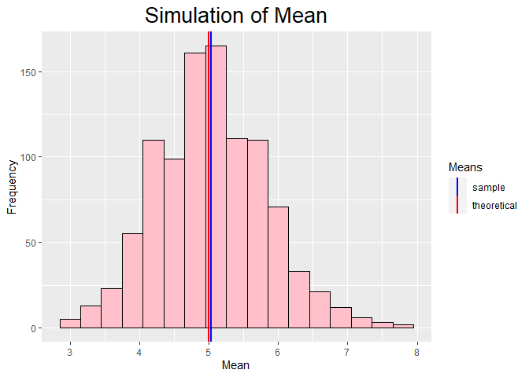
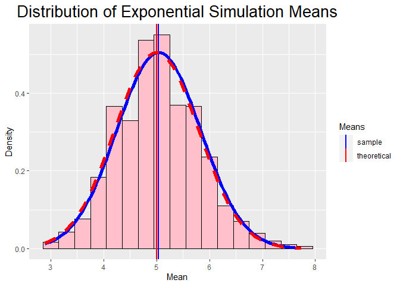

# OVERVIEW

In this project you will investigate the exponential distribution in R and compare it with the Central Limit Theorem. The exponential distribution can be simulated in R with rexp(n, lambda) where lambda is the rate parameter. 

The mean of exponential distribution is 1/lambda and the standard deviation is also 1/lambda. Set lambda = 0.2 for all of the simulations. You will investigate the distribution of averages of 40 exponentials. 


## SIMULATIONS

```r
# set seed for reproducability

set.seed(2019)

# set sampling values:

lambda <- 0.2   # rate parameter
n <- 40         # number of samples in each simulation
nsim <- 1000    # number of simulations numSimulations

# simulate the population
simMeans <- data.frame(expMean = sapply(1 : nsim, function(x) {mean(rexp(n, lambda))}))
```

## 1- SAMPLE MEAN VERSUS THEORETICAL MEAN


### Analysis

Calculate the sample mean and theoretical mean across all 1000 simulations of
40 samples from an exponential distribution where $\lambda = 0.2$. 


```r
# calculate sample mean and theoretical mean
sampleMean <- mean(simMeans$expMean)
theoMean <- 1/lambda
compMeans <- data.frame(sampleMean, theoMean)
names(compMeans) <- c("Sample Mean", "Theoretical Mean")
print(compMeans)
```

```
##   Sample Mean Theoretical Mean
## 1    5.038755                5
```

### Plot Distribution

Display a histogram to show the averages of the 40 exponentials over 1000 simulations. 
Include the sample mean and theoretical mean for comparison.


```r
# plot the distribution (sample mean versus theoretical mean)

ggplot(simMeans, aes(x = expMean, y = ..count..)) +
    geom_histogram(binwidth = 0.3, color = "black", fill = "pink")  +
    geom_vline(aes(xintercept = sampleMean, color = "sample"), size = 1) +
    geom_vline(aes(xintercept = theoMean, color = "theoretical"), size = 1) +
    xlab("Mean") +
    ylab("Frequency") +
    theme(plot.title = element_text(size = 20, hjust = 0.5)) +
    scale_color_manual(name = "Means", values = c(sample = "blue", theoretical = "red")) +
    ggtitle("Simulation of Mean")
```

<!-- -->

Through the lines, it is observed that sample mean and theoretical mean are very close. To check if there is a statistically significant difference between the means, a T test was performed, with 95%
confidence


```r
t.test(simMeans$expMean, conf.level = 0.95)
```

```
## 
## 	One Sample t-test
## 
## data:  simMeans$expMean
## t = 201.5, df = 999, p-value < 2.2e-16
## alternative hypothesis: true mean is not equal to 0
## 95 percent confidence interval:
##  4.989684 5.087827
## sample estimates:
## mean of x 
##  5.038755
```
### Findings

Through the graphic analysis, a similarity was observed between the means, however through the T test it was found that the means differ statistically.


## 2- SAMPLE VARIANCE VERSUS THEORETICAL VARIANCE

### Analysis

The theoretical variance is $\frac{(\frac{1}{\lambda})^2}{n}$.


```r
# calculate sample variance and theoretical variance

sampleVariance <- var(simMeans$expMean)

theoVariance <- ((1/lambda)^2)/n

compVariance <- data.frame(sampleVariance, theoVariance)

names(compVariance) <- c("Sample Variance", "Theoretical Variance")

print(compVariance)
```

```
##   Sample Variance Theoretical Variance
## 1       0.6253269                0.625
```

### Findings

The sample variance is very close to the theoretical variance.


# 3- DISTRIBUTION

Determine whether the exponential distribution is approximately normally distributed in relation to the population average. According to the Central Limit Theorem, the averages of the sample simulations must follow a normal distribution.


```r
# plot the distribution
ggplot(simMeans, aes(x = expMean)) +
    geom_histogram(aes(y = ..density..), binwidth = .3, color = "black", fill = 'pink')  +
    geom_vline(aes(xintercept = sampleMean, color = "sample"), size = 1) +
    geom_vline(aes(xintercept = theoMean, color = "theoretical"), size = 1) +
    xlab("Mean") +
    ylab("Density") +
    theme(plot.title = element_text(size = 20, hjust = 0.5)) +
    scale_color_manual(name = "Means", values = c(sample = "blue", theoretical = "red")) +
    stat_function(fun = dnorm, args = list(mean = sampleMean, 
                                           sd = sqrt(sampleVariance)), color = "blue", size = 2) +
  
    stat_function(fun = dnorm, args = list(mean = theoMean, sd = sqrt(theoVariance)), 
                  color = "red", size = 2, linetype = "dashed") + 
  ggtitle("Distribution of Exponential Simulation Means")
```

<!-- -->
According to the chart, the distribution of means of the samples' exponential distributions appears to follow a normal distribution.
