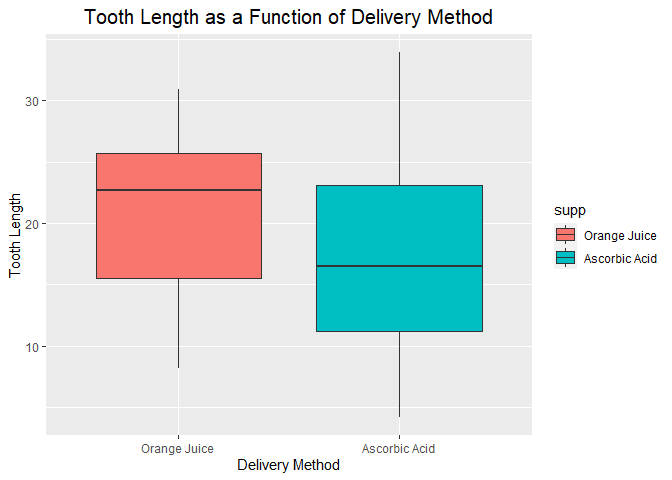
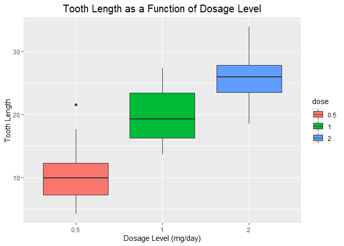
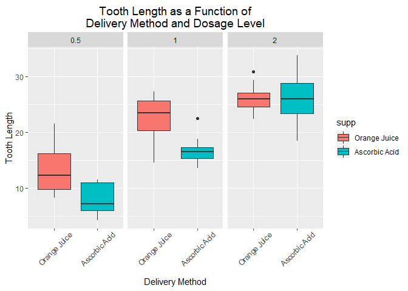

# OVERVIEW

In the second portion of the project, we're going to analyze the ToothGrowth data in the R datasets package


# DATA SUMMARY

After loading the ToothGrowth dataset, provide a basic summary of the data.


```r
# load the sample dataset containing ToothGrowth data
data ("ToothGrowth")

str(ToothGrowth)
```

```
## 'data.frame':	60 obs. of  3 variables:
##  $ len : num  4.2 11.5 7.3 5.8 6.4 10 11.2 11.2 5.2 7 ...
##  $ supp: Factor w/ 2 levels "OJ","VC": 2 2 2 2 2 2 2 2 2 2 ...
##  $ dose: num  0.5 0.5 0.5 0.5 0.5 0.5 0.5 0.5 0.5 0.5 ...
```

```r
summary(ToothGrowth)
```

```
##       len        supp         dose      
##  Min.   : 4.20   OJ:30   Min.   :0.500  
##  1st Qu.:13.07   VC:30   1st Qu.:0.500  
##  Median :19.25           Median :1.000  
##  Mean   :18.81           Mean   :1.167  
##  3rd Qu.:25.27           3rd Qu.:2.000  
##  Max.   :33.90           Max.   :2.000
```

```r
head(ToothGrowth, 10)
```

```
##     len supp dose
## 1   4.2   VC  0.5
## 2  11.5   VC  0.5
## 3   7.3   VC  0.5
## 4   5.8   VC  0.5
## 5   6.4   VC  0.5
## 6  10.0   VC  0.5
## 7  11.2   VC  0.5
## 8  11.2   VC  0.5
## 9   5.2   VC  0.5
## 10  7.0   VC  0.5
```


```r
# tabulate delivery method and dosage level values
table(ToothGrowth$supp, ToothGrowth$dose)
```

```
##     
##      0.5  1  2
##   OJ  10 10 10
##   VC  10 10 10
```


```r
# summary of tooth length data grouped by delivery method and dosage level
by(data = ToothGrowth$len, INDICES = list(ToothGrowth$supp, ToothGrowth$dose), summary)
```

```
## : OJ
## : 0.5
##    Min. 1st Qu.  Median    Mean 3rd Qu.    Max. 
##    8.20    9.70   12.25   13.23   16.18   21.50 
## ------------------------------------------------------------ 
## : VC
## : 0.5
##    Min. 1st Qu.  Median    Mean 3rd Qu.    Max. 
##    4.20    5.95    7.15    7.98   10.90   11.50 
## ------------------------------------------------------------ 
## : OJ
## : 1
##    Min. 1st Qu.  Median    Mean 3rd Qu.    Max. 
##   14.50   20.30   23.45   22.70   25.65   27.30 
## ------------------------------------------------------------ 
## : VC
## : 1
##    Min. 1st Qu.  Median    Mean 3rd Qu.    Max. 
##   13.60   15.28   16.50   16.77   17.30   22.50 
## ------------------------------------------------------------ 
## : OJ
## : 2
##    Min. 1st Qu.  Median    Mean 3rd Qu.    Max. 
##   22.40   24.57   25.95   26.06   27.07   30.90 
## ------------------------------------------------------------ 
## : VC
## : 2
##    Min. 1st Qu.  Median    Mean 3rd Qu.    Max. 
##   18.50   23.38   25.95   26.14   28.80   33.90
```


# EXPLORATORY DATA ANALYSIS

Perform some basic exploratory data analyses of the data. The analyses will
explore the following relations:

1. Tooth Length as a function of Delivery Method
2. Tooth Length as a function of Dosage Level
3. Tooth Length as a function of Delivery Method (supp) and Dosage Level

###  1- Tooth Length to Delivery Method


```r
levels(ToothGrowth$supp) <- c("Orange Juice", "Ascorbic Acid")

ggplot(data = ToothGrowth, aes(x = supp, y = len)) + 
    geom_boxplot(aes(fill = supp)) +
    xlab("Delivery Method") +
    ylab("Tooth Length") +
    theme(plot.title = element_text(size = 15, hjust = 0.5)) +
    ggtitle("Tooth Length as a Function of Delivery Method") 
```

<!-- -->
### Findings

Based on the graph, it is observed that, regardless of the dosage level, the use of orange juice as a method of administration had a more favorable effect on tooth growth than ascorbic acid.


## 2- Tooth Length to Dosage Level


```r
ggplot(data = ToothGrowth, aes(x = factor(dose), y = len)) + 
    geom_boxplot(aes(fill = factor(dose))) +
    xlab("Dosage Level (mg/day)") +
    ylab("Tooth Length") +
    guides(fill=guide_legend(title="dose")) +
    theme(plot.title = element_text(size = 15, hjust = 0.5)) +
    ggtitle("Tooth Length as a Function of Dosage Level")
```

<!-- -->

### Findings

Based on the graph, it is observed that higher levels of vitamin C dosage, regardless of the method of administration, had a more favorable effect on tooth growth.


## 3- Tooth Length to Delivery Method and Dosage Level


```r
levels(ToothGrowth$supp) <- c("Orange Juice", "Ascorbic Acid")

ggplot(data = ToothGrowth, aes(x = supp, y = len)) + 
    geom_boxplot(aes(fill = supp)) +
    facet_wrap(~ dose) +
    xlab("Delivery Method") +
    ylab("Tooth Length") +
    guides(fill=guide_legend(title="supp")) +
    theme(plot.title = element_text(size = 14, hjust = 0.5, vjust = 0.5),
          axis.text.x = element_text(angle = 45,
                                     hjust = 0.5,
                                     vjust = 0.5,
                                     margin = margin(b = 10))) +
    ggtitle("Tooth Length as a Function of\nDelivery Method and Dosage Level")
```

<!-- -->

### Findings

Based on the graph, for dosages of 0.5 to 1 mg/day, orange juice was better. As for the 2mg/day dosage by the median, there was no difference between the means of administration, however if we look at the quartiles, orange juice has a more robust result.


## INFERENTIAL STATISTICS


Use confidence intervals and/or hypothesis tests to compare tooth growth by supp and dose. For this a t-test will be performed 
crescimento do dente.

### Hypothesis 1

Test if whether is any correlation between tooth grow and dogase level  
The null hypothesis that the two delivery methods have no effect on
tooth growth.


```r
t.test(len ~ supp, data = ToothGrowth, conf.level = 0.95)
```

```
## 
## 	Welch Two Sample t-test
## 
## data:  len by supp
## t = 1.9153, df = 55.309, p-value = 0.06063
## alternative hypothesis: true difference in means is not equal to 0
## 95 percent confidence interval:
##  -0.1710156  7.5710156
## sample estimates:
##  mean in group Orange Juice mean in group Ascorbic Acid 
##                    20.66333                    16.96333
```
P-value is 0.06063 (>0.05)
Confidence Interval is -0.17 to 7.57 (contains 0)
This indicates weak evidence against the
null hypothesis so we fail to reject the null hypothesis. So the dosage seems to have no impact on Tooth growth


### Hypothesis 2

Study the impact of delivery method on tooth growth for a single dosage level.
A t-test will be performed by comparing Tooth Grow with Dose Amount looking at the different pairs of dose values


```r
# Dose amounts 0.5 and 1.0
t.test(len~dose,data=subset(ToothGrowth, ToothGrowth$dose %in% c(1.0,0.5)))
```

```
## 
## 	Welch Two Sample t-test
## 
## data:  len by dose
## t = -6.4766, df = 37.986, p-value = 1.268e-07
## alternative hypothesis: true difference in means is not equal to 0
## 95 percent confidence interval:
##  -11.983781  -6.276219
## sample estimates:
## mean in group 0.5   mean in group 1 
##            10.605            19.735
```
P-value is 1.268e-07 (>0.05)
Confidence Interval is -11.983781 to -6.276219 (doesn’t contains 0)
Based on these results, it was found that between 0.05mg/day and 1 mg/day there is a difference in tooth growth


```r
# Dose amounts 0.5 and 2.0
t.test(len~dose,data=subset(ToothGrowth, ToothGrowth$dose %in% c(2.0,0.5)))
```

```
## 
## 	Welch Two Sample t-test
## 
## data:  len by dose
## t = -11.799, df = 36.883, p-value = 4.398e-14
## alternative hypothesis: true difference in means is not equal to 0
## 95 percent confidence interval:
##  -18.15617 -12.83383
## sample estimates:
## mean in group 0.5   mean in group 2 
##            10.605            26.100
```
P-value is 4.398e-14 (>0.05)
Confidence Interval is -18.15617 to -12.83383 (doesn’t contains 0)
Based on these results, it was found that between 0.05mg/day and 2mg/day there is a difference in tooth growth


```r
# Dose amounts 1.0 and 2.0
t.test(len~dose,data=subset(ToothGrowth, ToothGrowth$dose %in% c(2.0,1.0)))
```

```
## 
## 	Welch Two Sample t-test
## 
## data:  len by dose
## t = -4.9005, df = 37.101, p-value = 0.00001906
## alternative hypothesis: true difference in means is not equal to 0
## 95 percent confidence interval:
##  -8.996481 -3.733519
## sample estimates:
## mean in group 1 mean in group 2 
##          19.735          26.100
```
P-value is 0.00001906 (>0.05)
Confidence Interval is -8.996481 to -3.733519 (doesn’tcontains 0)
Based on these results, it was found that between 0.05mg/day and 1 mg/day there is a difference in tooth growth


# CONCLUSION

## Assumptions

 - Tooth growth follows a normal distribution.

 - The sample is representative of the population


## Conclusions

Based on exploratory data analysis and confirmed by hypothesis tests and associated confidence intervals, we can safely infer that an increase in dosage levels of vitamin C increases tooth growth. 
However, the delivery method had any effect on tooth growth.
