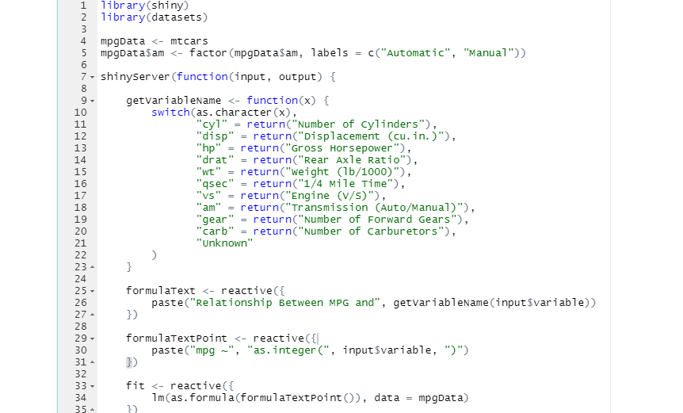

```{r setup, include=FALSE}
knitr::opts_chunk$set(echo = FALSE)
```

## Synopsis

The course project is a two part peer-graded assignment:

- Create a Shiny application and deploy it on RStudio's servers

- Use Slidify or RStudio Presenter to prepare a reproducible pitch presentation
about your application.

The name of the Shiny application developed for this project is the
**Motor Trend Data Analysis Application** and is hosted on RStudio's
shinyapps.io hosted service:

<a target="_blank" href="https://sdmuzel.shinyapps.io/shiny-app/">https://sdmuzel.shinyapps.io/shiny-app/</a>

## Motor Trend Data Analysis Application

**Motor Trend Data Analysis** is an interactive Shiny application that uses
linear regression modeling techniques to estimate fuel consumption (MPG) in 32
automobiles (1973-74 models) based on 11 aspects of automobile design and
performance.

## Variables

Miles/(US) gallon
Number of cylinders
Displacement (cu.in.)
Gross horsepower,
Rear axle ratio
Weight (1000 lbs)
1/4 mile time"),
Engine (0 = V-shaped, 1 = straight)"),
Transmission (0 = automatic, 1 = manual)
Number of forward gears
Number of carburetors")


## R code

```{r, echo=FALSE,  out.width = '100%'}
# add figure


```


